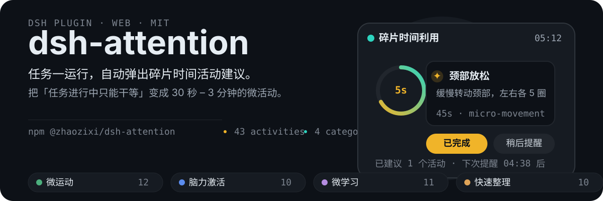
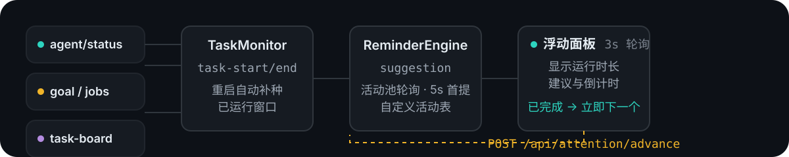

<p align="center">
  
</p>

# dsh-attention

<p align="center">
  <strong>简体中文</strong> · <a href="./README_EN.md">English</a>
</p>

<p align="center">
  <a href="https://github.com/topics/dsh-plugin"></a>
  <a href="https://www.npmjs.com/package/@zhaozixi/dsh-attention"></a>
  <a href="https://github.com/zhaozixi/dsh-attention/blob/main/LICENSE"></a>
  <a href="https://www.npmjs.com/package/@deepseek-ai/dsh"></a>
</p>

在 DeepSeek Harness 执行长时间任务（目标循环、后台任务、Agent 推理、任务看板执行）期间，主动提醒你利用碎片时间进行微活动，解决「任务进行中只能干等」的低效问题。

## 它解决什么问题

DSH 跑任务时你通常只能盯着进度条。dsh-attention 把这段等待变成**有产出的碎片时间**：任务一运行，5 秒后浮窗弹出，给你一条 30 秒–3 分钟的微活动建议；点「已完成」立即出下一条，任务结束自动收起并生成碎片利用报告。

## 功能

- **多信号源任务监控** — `agent/status`（主会话对话、子代理、task-board 执行会话全覆盖）、goal 轮次、后台任务（jobs）、任务看板状态轮询，统一检测任务开始/结束。
- **重启恢复** — host 重启后自动补种恢复运行中的任务窗口，重启前在跑的任务重启后继续提醒。
- **提醒引擎** — 按可配置节奏推送活动建议（默认 5 分钟）；「已完成」立即推进下一条；任务结束生成碎片利用报告。
- **内置活动库** — 43 条预设微活动，四大类**随机分配**（每个新任务会话重新洗牌），同一会话内不重复。
- **活动池编辑器** — 左侧栏「注意力」入口弹出编辑面板，四个分类可增删改活动，右下角保存/取消，持久化到 profile。
- **全局置顶浮窗** — z-index 最大 + React Portal 挂 body，盖过一切弹窗；显示运行时长、建议数、下次提醒倒计时。

## 它是怎么工作的

<p align="center">
  
</p>

任务信号（agent 状态 / goal / 后台任务 / 任务看板）→ **TaskMonitor** 归一化为 task-start/task-end → **ReminderEngine** 按节奏发建议（可配自定义活动表）→ 浏览器**浮动面板** 3 秒轮询展示；点「已完成」走 `POST /api/attention/advance` 立即出下一条。

## 快速开始

### 安装（npm）

```sh
dsh plugin --profile web add @zhaozixi/dsh-attention@latest
```

首次安装如遇 pnpm 拦截构建脚本，在 profile 目录执行 `pnpm approve-builds --all` 后重试。

安装后**重启 DSH**（host 半加载）并**硬刷新浏览器**（client 半生效）。左侧栏「新会话」下方出现 ⭐「注意力」入口。

### 本地源码开发（link）

```sh
dsh plugin --profile web add link:../packages/dsh-attention
```

## 配置

在 profile 的 `cordis.patch.yml` 中覆盖 `attention` 行：

```yaml
- id: attention
  config:
    enabled: true
    remindIntervalMs: 300000      # 提醒间隔（点「已完成」可立即推进，不等此间隔）
    firstReminderDelayMs: 5000    # 任务开始后首条提醒延迟
    categories:                   # 活动类别池
      - micro-movement
      - mind-refresh
      - micro-learning
      - quick-organize
    maxActivitiesPerSession: 6    # 每会话建议上限
```

## 自定义活动池

1. 点击左侧栏「注意力」入口（新会话下方）。
2. 面板按四个分类列出活动，每行可编辑标题、指引文案，可删除；每区底部「+ 添加活动」。
3. 右下角「保存」持久化到 `~/.dsh/profiles/web/attention-activities.json`（随 profile 携带），引擎立即按新表轮询；「取消」丢弃改动。

## HTTP API

| 端点 | 方法 | 用途 |
|---|---|---|
| `/api/attention/state` | GET | 面板状态快照（busy / 运行时长 / 下次提醒 / 最后建议） |
| `/api/attention/snooze` | POST | 暂停当前提醒节奏 |
| `/api/attention/resume` | POST | 恢复提醒节奏 |
| `/api/attention/advance` | POST | 立即推进到下一个活动（「已完成」） |
| `/api/attention/activities` | GET / POST | 读取 / 保存活动池（含自定义） |

## 目录结构

```
dsh-attention/
├── package.json            # dsh.bundle + dsh.client 声明
├── cordis.patch.yml        # profile 补丁：注册 attention 行
├── assets/readme/          # README 视觉资源（hero / workflow SVG）
└── lib/
    ├── index.js            # Host Service 入口（监控 + 引擎 + HTTP + 活动池持久化）
    ├── monitor.js          # 任务状态监控（agent/status + goal + jobs + task-board + 重启 seed）
    ├── reminder-engine.js  # 提醒引擎（调度 + 随机活动池 + 自定义活动表）
    ├── activities.js       # 内置活动库（43 条预设）
    ├── client.js           # 浏览器端：浮动面板 + 侧边栏入口 + 活动池编辑器
    └── invariant.js        # 断言辅助
```

## 常见问题

| 现象 | 原因与解决 |
|---|---|
| 任务运行但无提醒 | 确认已重启 DSH（host 半改动需重启）+ 硬刷新浏览器；检查 `/api/attention/state` 的 `busy` 是否为 true |
| 无任务但提醒仍显示 | 运行中会话被关闭/删除时旧窗口残留——已通过 `agent/disposed` 监听修复；如仍出现请升级到最新版本 |
| 重启后不提醒进行中的任务 | 旧版本无 seed 恢复；升级后 `agent/status` 与 goal 均支持重启补种 |
| 活动池编辑不生效 | 保存走 `POST /api/attention/activities` 持久化；确认保存后引擎 `poolSize` 变化 |

## 贡献

本项目是**开源软件**（MIT License），欢迎任何人参与：

1. **Fork** 本仓库到你的账号
2. 基于 `main` 分支创建你的特性分支（`git checkout -b feat/xxx`）
3. 提交改动后发起 **Pull Request** 到 `main`

改动建议附带说明（修复的问题 / 新增功能 / 影响范围）。涉及活动池或提醒节奏的改动，请同步更新 README 与测试说明。

## License

[MIT](./LICENSE)
